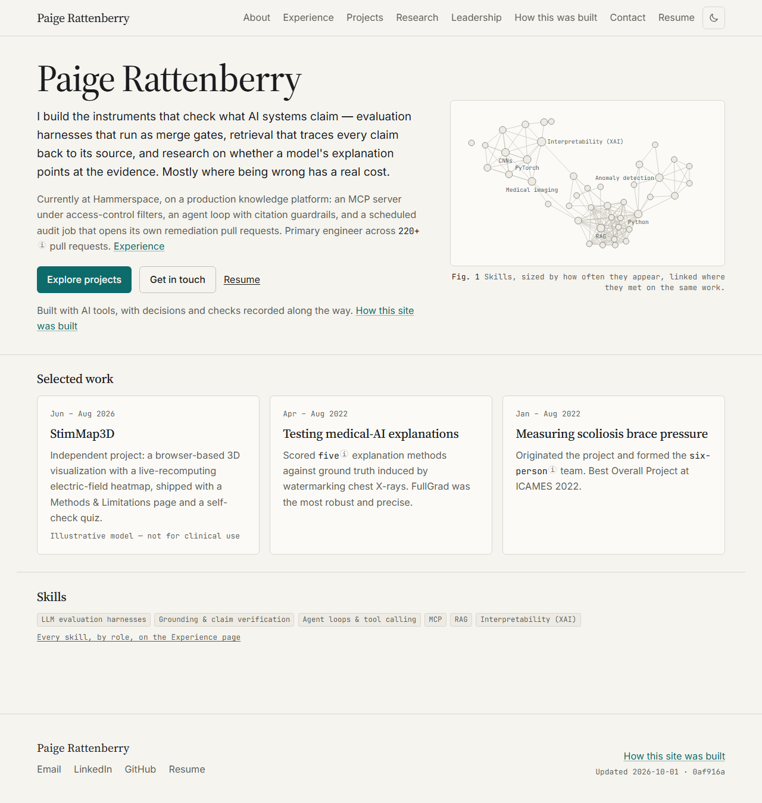

# Paige Rattenberry — Portfolio Site

Personal portfolio for Paige Rattenberry: work, research, volunteer and leadership, personal
projects (StimMap3D and others), and a transparent account of how the site itself was planned
and built with AI tools. Every session used Claude Code; the September 13 review and its
follow-up used Codex.



**Status:** every planned session is built: Home, About, Experience with its timeline and skills
explorer, Projects with four deep pages (StimMap3D with a click-to-load live demo), Research,
Leadership, the resume PDF generated from `content/`, SEO and Open Graph images, the three CI
gates (build and tests, axe, Lighthouse), the publication gate, and `/how-this-was-built`, which
renders every build log, a pre-launch history snapshot and a synthesis of what the AI got wrong
and what caught it. Session 9 updated the content before launch, and Session 9b made three small
fixes. The record of each session is in [`docs/build-log/`](./docs/build-log/), and the launch
steps are in `IMPLEMENTATION_PLAN.md` §6.

## Stack

Next.js 16 (App Router, fully static) · React 19 · TypeScript (strict) · Tailwind CSS 4 ·
next-themes · Vitest + Testing Library · Playwright + axe · GitHub Actions · Vercel.

## Run locally (PowerShell, Node 24)

```powershell
npm install
npm run dev          # http://localhost:3000
```

Checks, in the order CI runs them:

```powershell
npm run lint         # ESLint (eslint-config-next + prettier)
npm run typecheck    # next typegen + tsc --noEmit
npm test             # Vitest unit/component tests, including the publication gate
npm run build        # production build; every route is prerendered
npm run e2e:a11y     # Playwright + axe over every route in both themes (needs a build first; serves on :3100)
npm run e2e:features # Playwright: the /projects filter, the /experience explorer, the SEO checks and font coverage
npm run budget       # after a build: the site's own client JS on / must stay within 15 KB gzipped
npm run lighthouse   # Lighthouse CI, mobile, against the production build (CI job 3; on Windows use node scripts/lighthouse-local.mjs)
npm run fonts        # rewrite app/fonts/ (the build only checks it)
npm run e2e:screenshots   # writes docs/screenshots/s<N>-*.png (set $env:SESSION = "2" etc.)
npx tsx scripts/fetch-build-stats.ts   # by hand only: refresh the history snapshot (needs gh auth)
```

First time only: `npx playwright install chromium`. After a content change that adds or re-tags a
skill, run `npm run layout:explorer` and commit `content/generated/explorer-layout.json`; the build
only checks that file. `npm run dev`, `npm test` and `npm run build` all render the resume PDF first
(`scripts/build-resume.tsx` writes `public/Paige-Rattenberry-Resume.pdf`, which is git-ignored); run
`npm run resume` by hand before a bare `vitest`.

In a clone, `npm test` fails on one check until you set `PUBLICATION_TERMS_OPTIONAL=1`. Part of
the publication gate reads a term list that is not in the repository (CI reads it from a secret).
With the variable set, the gate's committed checks still run and the private half is skipped:

```powershell
$env:PUBLICATION_TERMS_OPTIONAL = "1"; npm test
```

On macOS or Linux (bash, zsh):

```sh
PUBLICATION_TERMS_OPTIONAL=1 npm test
```

Copy `.env.example` to `.env.local` and set `NEXT_PUBLIC_SITE_URL` to the public origin: it is the
`metadataBase` for canonical URLs, the sitemap, robots.txt, the JSON-LD and the site line on the
resume. **Set it in Vercel too** (every environment); without it a Vercel build falls back to the
project's production hostname.

## Layout

- `app/` routes and `globals.css` (design tokens).
- `components/` layout shell, UI primitives, hero contour motif, project cards, the explorer.
- `content/` the single source of truth for every fact on the site (`content/generated/` holds the
  committed explorer layout and the build-stats snapshot; `content/build-story.ts` the words of
  `/how-this-was-built`).
- `lib/content/` the only code that imports `content/`; `lib/explorer/` the explorer layout and view data.
- `scripts/` build-time generators and checks (the resume PDF, the explorer layout, the derived PDFs).
- `lib/routes.ts` serializable route metadata; Header passes navigation data to the client.
- `AGENTS.md` shared instructions for all coding agents; `CLAUDE.md` references them.
- `tests/unit/` Vitest; `tests/e2e/` Playwright (`a11y.spec.ts`, `projects.spec.ts`,
  `explorer.spec.ts`, `seo.spec.ts`, `fonts.spec.ts`, `screenshots.spec.ts`).
- `docs/build-log/`, `docs/screenshots/` the per-session build story, rendered on
  `/how-this-was-built`.
- `_source/` Paige's source materials and `private/` her notes. Both git-ignored, never committed.

## Deployment

Use `npm run build` for Vercel builds, so `prebuild` runs: it checks the committed explorer layout
and font files and renders the resume PDF. No build calls the GitHub API, and Vercel needs no
token: the history counts on `/how-this-was-built` are a committed snapshot. Vercel builds every
push. **Until launch step L7 there is deliberately no production deployment**: the
production branch is `launch` (which is never pushed to) and production builds are skipped, so
`paigerattenberry.vercel.app` returns `404 DEPLOYMENT_NOT_FOUND` while the site is being built. Every
branch, `main` included, deploys as a preview that requires a Vercel login and carries
`X-Robots-Tag: noindex` — that is how the site stays private and unsearchable before launch. The
reasoning and the exact settings are in `IMPLEMENTATION_PLAN.md` §3 S0-E, and the launch steps
(§6) reverse two of them after Vercel is re-pointed at the public repository.

## Planning documents

- [`DESIGN.md`](./DESIGN.md) — decisions, site map, content model, visual direction, architecture, quality bar.
- [`IMPLEMENTATION_PLAN.md`](./IMPLEMENTATION_PLAN.md) — repo structure, dependencies, prerequisites, the sessions with their acceptance criteria (S0-G included), and the launch steps.
- [`SESSION_PROMPTS.md`](./SESSION_PROMPTS.md) — one paste-ready coding-agent prompt per session.

## License

Code is MIT (see `LICENSE`). Site content, text and images are © Paige Rattenberry.
